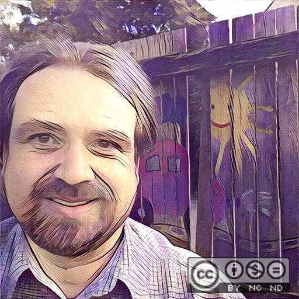

# Sudoku
 A free implementation of the well-known <b>Sudoku</b> number puzzle.

* <em>Start an online</em> <b>Sudoku</b> <em>session on</em> http://omerkel.github.io/Sudoku/html5/src/
* <em>runs in various browsers on</em>
    * <em>desktop systems like BSDs, Linux, Win, MacOS and</em>
    * <em>mobile platforms like Android, FirefoxOS, iOS.</em>

<b>Keywords, Categories</b> <em>Number Puzzle, Logic Puzzle, Recreational Mathematics,
Latin Squares, Games/Entertainment, Mobile</em>

<em>Sudoku</em> implements the well-known number puzzle. Objective
  of Sudoku is to fill the empty cells with digits ranged from 1 to 9
  in a valid pattern. Some cells are already holding fixed digits and
  cannot be edited. A valid pattern means that

<ul>
<li>each row does not contain any duplicate of digits, and</li>
<li>each column does not contain any duplicate of digits, and</li>
<li>each of the nine three-times-three subgrids does not contain any
  duplicate of digits.</li>
</ul>

On clicking an empty cell it gets marked by a question mark symbol.
  The question mark indicates that no specific number is selected for
  this cell so far. Now you can select a digit ranged from 1 to 9 to
  fit in the cell. To clear the cell a question mark can be
  reselected, too.

<h3>Some hints and facts</h3>

The Sudoku generator in use here is explicitly not only supporting
  symmetric cell patterns that often can be found in other Sudokus.

This type of number puzzle does actually not have Asian origin.
  Anyway it got popular under the name Sudoku being published by a
  Japanese puzzle company in mid 1980s. Sudoku is an abbreviation
  of the Japanese <i>Suji wa dokushin ni kagiru</i>. This could be
  translated to <i>Digits must be singletons</i>.

Any Sudoku solution represents a form or relation towards so
  called Latin square in a Mathematical sense.

### Contributors / Authors

<table>
  <tr>
    <td>
Oliver Merkel,  This image is licensed under a <a rel="license" href="http://creativecommons.org/licenses/by-nc-nd/4.0/">Creative Commons Attribution-NonCommercial-NoDerivatives 4.0 International License</a>.    
    

    </td>
    <td width="50%"></td>
  </tr>
</table>

_All logos, brands, and trademarks mentioned belong to their respective owners._
